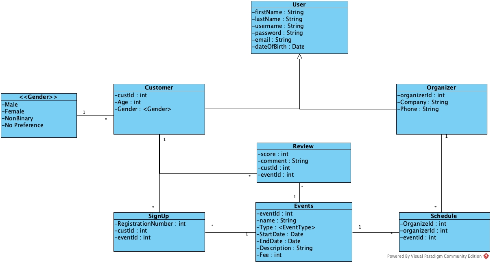

Event Registration Application
==
Team members: Jirawat Zhou, Emre Gucer

### Problem statement
With many events that take place in real world we will need a solution that allow organizer to manage their events efficiency, while also allows customers to signup for events.

### Solution Description
Proposed a web application that allows organizers to manage their events and attendees. While attendees can look and search for events that they are interested in and sign up for the events.
```
1. Allow User to SignUp/Register for Events
2. Allow User to Add/Read/Edit/Delete Reviewsfor each Event
3. Allow Organizer to Host/Schedule a Event
4. Allow Organizer to Add/Read/Edit/Delete Events
5. Allow User to create account to database
6. Allow Organizer to create account to database
```

### User that would use my solution
User that are looking for software that allow them to schedule event and allow their customer to signup for their event

### Domain Objects
Events Model: Represent the event which will contain the following information
```
1. name which represent the name of the event
2. type which represent the format of the event (Expo, Conference, Concert).
3. StartDate which represent the starting date of the event
4. EndDate which represent the ending date of the event
5. Description which represent the event description
6. Fee which represent the fee to enter a event
```

Review Model: Represent the review for which customer can create a review for any events
```
1. score for which a customer can review
2. comment for which a customer can comment/review the events
3. CustomerId which represent the customer
4. EventId which represent the event
```


### UML Diagram


### Description of User Data Model
Customer Model: Represent the customer which contained the following information
```
1. first name which represent customer first name
2. last name which represent customer last name
3. username which allow customer to fill in to specify their username
4. password which authenticate the user if necessary
5. email which represent customer contact information
6. dateOfbirth which represent customer's Date of Birth
7. age which represent customer's age
8. gender which represent customer's gender (Implement with Protable Enum)
```

Organizer Model: Represent the organizer which contained the following information
```
1. first name which represent customer first name
2. last name which represent customer last name
3. username which allow customer to fill in to specify their username
4. password which authenticate the user if necessary
5. email which represent customer contact information
6. dateOfbirth which represent customer's Date of Birth
7. company name which represent the organizer's company
8. phone which represent organizer contact information
```

### Description of Domain Objects

Events Model: Represent the event which will contain the following information
```
1. name which represent the name of the event
2. type which represent the format of the event (Expo, Conference, Concert).
3. StartDate which represent the starting date of the event
4. EndDate which represent the ending date of the event
5. Description which represent the event description
6. Fee which represent the fee to enter a event
```

Review Model: Represent the review for which customer can create a review for any events
```
1. score for which a customer can review
2. comment for which a customer can comment/review the events
3. CustomerId which represent the customer
4. EventId which represent the event
```

### User to Objects Relationships
Customer and Events is a many-to-many relationship which one customer can register for many events 
while many events can have many customers. Therefore Register table is created to mediates the many relationship between User and Event object.

Organizer and Event is a many-to-many relationship which one organizer can schedule many events and many events can also have many schedule. Therefore a host table is create to mediate the many-to-many relationship between Organizer and Event objects.

Register model: Represent each sign up reocord between the customer and the events that take place, which will contain the following information
```
1. RegistrationId which represent the id which it will represent for each sign up record
2. CustomerId which represent the customer
3. EventId which represent the event
```

Schedule model: Represent each host record between the organizer and the events that take place, which will contain the following information
```
1. OrganizeId which represent the id which it will represent for each sign up record
2. CustomerId which represent the customer
3. EventId which represent the event
```
Customer and Review is a one-to-many relationship since a customer can have many review, while each review only have one customer.
### Domain to Domain Relationship
Event and Review is a one-to-many relationship since a event can have many reviews and a review can only have one event.  

### Description of Portable Enumeration
Gender Portable Enum: which contained all the possible gender for customer
```
1. Male
2. Female
3. Non-Binary
4. Other
```

### Description of the User Interface
1. EventEditor
2. CustomerEditor
3. OrganizerEditor.js
4. EventList
5. OrganizerListForAEvent
6. CustomerListForAEvent


## Project Requirement
```
1. Java 11+
2. Maven 3.8.1 or up
3. NodeJs (v12.18.1)
4. NPM (v7.8.0)
5. Intelij (Recommended)
```
#### Download Link
```
Java 11: https://www.oracle.com/java/technologies/javase-jdk11-downloads.html
Maven: https://maven.apache.org/download.cgi
NodeJs: https://nodejs.org/en/
```

### Instruction to Run Application
```
git clone https://github.com/Jirawatz/EventRegistrationApp
```
Or import via version control in InteliJ and make sure that all maven dependencies installed
```
cd \EventRegistrationApp\db-react\src\
```
Installing Node and NPM Dependencies

```
npm install
npm install axios bootstrap react-router-dom semantic-ui-react semantic-ui-css
```

Install Spring Boot Dependencies
```
cd \EventRegistrationApp\
mvn install
```
Running Spring boot
```
cd \EventRegistrationApp\
mvn spring-boot:run
```
Running React
```
cd \EventRegistrationApp\db-react\src\
npm start
```

open http://localhost:3000 in your browser to intereact with the user interface
